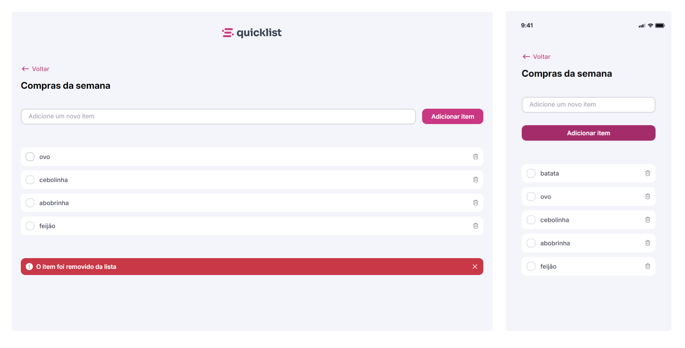

# Lista de Compras

    

## Projeto
> Formação FullStack - Rocketseat

Este projeto é uma aplicação de lista de compras desenvolvida com HTML, CSS e JavaScript, a partir do desafio prático de JavaScript.

## ✨ Funcionalidades da Aplicação

- **Adicionar Itens:** Os usuários podem adicionar itens à lista de compras através de um campo de entrada de texto e um botão. Além disso, a aplicação suporta a adição de itens ao pressionar a tecla Enter.
- **Remover Itens:** Cada item na lista pode ser removido individualmente através de um ícone de exclusão.
- **Alertas:** Após a remoção de um item, uma mensagem de alerta é exibida brevemente para confirmar a ação.
- **Responsividade:** A aplicação ajusta a visibilidade do logo e da barra de status com base no tamanho da janela.

### 📋 Detalhes da Implementação

- **Adicionar Itens:**
  - Quando o usuário insere o texto no campo de entrada e clica no botão "Adicionar item" ou pressiona a tecla Enter, o item é adicionado à lista e salvo no localStorage.
  - A lista de itens é carregada do localStorage quando a página é carregada.

- **Remover Itens:**
  - Cada item possui um ícone de exclusão. Ao clicar neste ícone, o item é removido da lista e do localStorage.
  - A lista é atualizada em tempo real, e uma mensagem de alerta é exibida para confirmar a remoção do item.

- **Manipulação da DOM:**
  - A criação e remoção de itens são realizadas dinamicamente usando JavaScript para manipular a DOM.

- **Eventos:**
  - Eventos de clique são utilizados para remover itens.
  - Eventos de teclado são utilizados para adicionar itens ao pressionar a tecla Enter.

- **LocalStorage:**
  - Utilizado para armazenar a lista de itens no navegador, garantindo que os itens permaneçam mesmo após a atualização da página.

## 🛠️ Tecnologias utilizadas

- HTML
- CSS
- JavaScript
- LocalStorage
